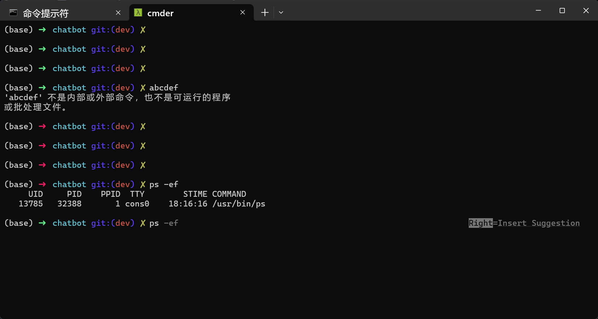

# robbyrussell-upgrade-ohmyposh-theme
This is a repository contain an upgrade version of robbyrussell style command line on ohmyposh, which can be used on Windows cmd. Much more similar to the origin robbyrussell style compared to which privided by ohmyposh official robbyrussell theme.

## Setup
1. Download Cmder(or clink if you don't want to use Cmder) and oh-my-posh according to their instruction.
2. Compile doblank.c into doblank.exe.
3. Set $CMDER\_ROOT$ env or replace the path in doblank.lua.
3. Put doblank.exe and doblank.lua into clink scripts directory(check with `clink info`).
4. Configure the theme according to [oh-my-posh configure instrcution](https://ohmyposh.dev/docs/installation/customize) and link the theme file to robbyrussellupgrade.omp.json.
5. Start your cmd, enjoy.

## Screenshot

